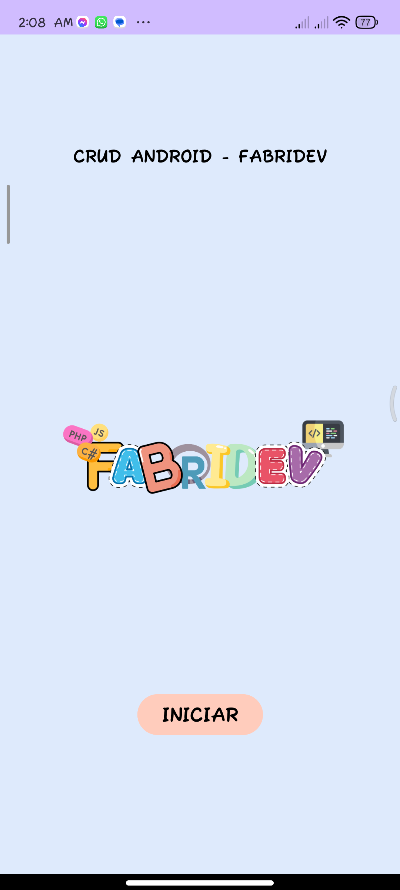
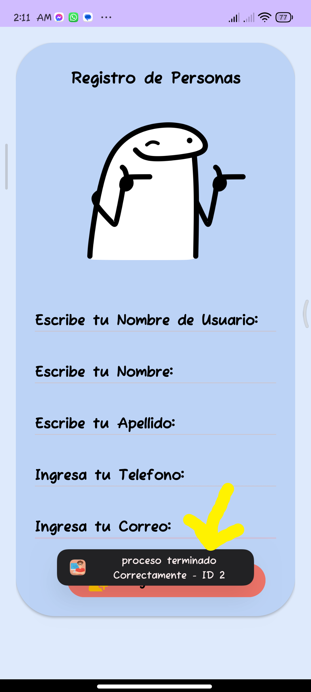

## CRUD ANDROID con JAVA
# Lenguajes Utilizados:

- JAVA
- SQLite
- FLATICON

# por el momento esta en mantenimiento ;)</h4>
Pero Puedes Visualizarlo en las siguientes imagenes:
- Parte principal

- Parte Opciones

- Parte Registro

- Alerta

- toast

### Para una mejor Experiencia descarga el APK 📱 pronto lo podras ven el la play store ;)
<a href="https://www.mediafire.com/file/fos4dw810de92qc/crud-senati.apk/file" class="btn btn-outline-success fa-solid fa-download"  title="descargar el proyecto">descargar</a

<h3 class="py-4"><b>Realizado por:</b> Fabrizio Barrios Saavedra (RFBS19 - fabridev)</h3>

